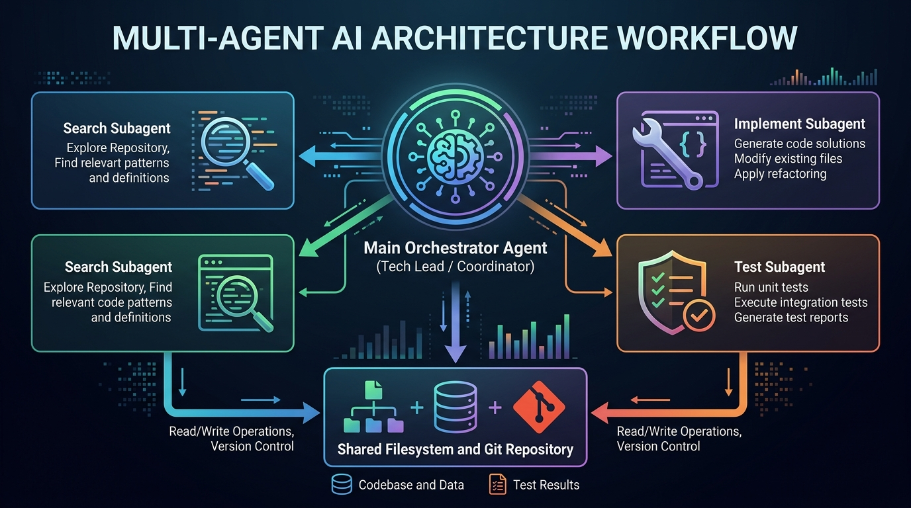

# Minh Họa Trực Quan Kiến Trúc Đa Tác Tử (Multi-Agent AI Workflow)

Tài liệu này giải thích chi tiết cách các Subagent độc lập (**Search**, **Implement**, **Test**) chia sẻ ngữ cảnh và phối hợp nhịp nhàng với nhau thông qua **Agent Điều Phối (Main Orchestrator)** và **Hệ thống tệp dùng chung (Shared Filesystem / Git)**.

---

## 1. Sơ Đồ Đồ Họa Tổng Quan



---

## 2. Mô Phỏng Thực Tế: Mô Hình "Tech Lead & 3 Chuyên Viên"

Để dễ hình dung nhất, hãy tưởng tượng luồng này giống hệt một **Đội ngũ phát triển phần mềm**:

```
                 ┌─────────────────────────────────────────┐
                 │       NGƯỜI DÙNG (Product Owner)         │
                 └────────────────────┬────────────────────┘
                                      │ "Tôi muốn thêm tính năng X"
                                      ▼
                 ┌─────────────────────────────────────────┐
                 │    MAIN ORCHESTRATOR AGENT (Tech Lead)  │
                 │  - Giữ toàn bộ bức tranh dự án          │
                 │  - Điều phối & giao việc từng người     │
                 │  - Tổng hợp dữ liệu trung gian          │
                 └───────┬─────────────────┬───────────────┘
                         │                 │
      (1) Giao đề bài    │                 │ (3) Chuyển giao kết quả
      "Hãy khảo sát..."  ▼                 ▼ "Hãy viết code dựa theo..."
┌───────────────────────────┐           ┌───────────────────────────┐
│     🔍 SEARCH AGENT       │           │    🛠️ IMPLEMENT AGENT     │
│   (Business Analyst/R&D)  │           │        (Developer)        │
│                           │           │                           │
│ • Chỉ ĐỌC (Read-Only)     │           │ • Chỉ VIẾT CODE           │
│ • Quét file, tìm hàm cũ   │           │ • Sửa file, thêm class    │
│ • Báo lại: "Cần sửa A, B" │           │ • Báo lại: "Đã code xong" │
└─────────────┬─────────────┘           └─────────────┬─────────────┘
              │                                       │
              │ Đọc mã nguồn                          │ Ghi code mới
              ▼                                       ▼
     ┌─────────────────────────────────────────────────────┐
     │        📁 SHARED FILESYSTEM & GIT REPOSITORY        │
     │        (Nơi lưu trữ mã nguồn thật của dự án)        │
     └─────────────────────────────────────────────────────┘
              ▲                                       ▲
              │ Đọc file vừa sửa                      │ Chạy lệnh test
              │                                       │
┌─────────────┴─────────────┐                         │
│      🧪 TEST AGENT        │                         │
│        (QA / Tester)      │─────────────────────────┘
│                           │
│ • Chạy npm test, tsc      │   (4) Tech Lead gọi Tester:
│ • Xác nhận 0 lỗi hồi quy  │   "Code đã lên đĩa, hãy test ngay!"
│ • Báo lại: "Xanh 100%"    │
└─────────────▲─────────────┘
              │
              └──────── Kết quả báo về Main Agent ──► Báo cáo User ✅
```

---

## 3. Bản Chất: Ngữ Cảnh Được Truyền Bằng Cách Nào?

Do mỗi Subagent có một "bộ não" (cửa sổ ngữ cảnh) hoàn toàn độc lập, chúng hiểu việc cần làm qua 3 kênh truyền tin:

### Kênh 1: Main Agent đóng vai trò "Người chuyển thư" (Prompt Injection)
- **Search Agent** kết thúc ➔ Gửi tin nhắn về cho Main:
  > *"Tôi tìm thấy `QuestionGenerator.tsx` đang có 1827 dòng. Các phần có thể tách là `AIProviderConfig` và `useQuestionGenerator`."*
- **Main Agent** lấy đoạn text đó nhét vào lệnh gọi **Implement Agent**:
  > *"Dựa vào kết quả của Search Agent: Hãy tách file `QuestionGenerator.tsx` thành `AIProviderConfig.tsx`..."*

### Kênh 2: Dữ liệu thực tế trên ổ cứng (Shared Filesystem)
- **Implement Agent** sửa file ➔ File trên ổ cứng (`src/components/...`) **thực sự thay đổi**.
- **Test Agent** không cần nghe ai hứa hẹn. Nó mở trực tiếp các file đó ra chạy lệnh:
  ```bash
  npx tsc --noEmit && npm test
  ```
- Ổ đĩa máy tính chính là "bảng nhớ chung" (Single Source of Truth) giữa các Agent.

### Kênh 3: Tin nhắn trực tiếp qua lại (Inter-agent Messaging)
Các Agent có thể gửi tin nhắn phản hồi trực tiếp cho nhau thông qua `conversationID`:
- Test Agent phát hiện lỗi compile ➔ Gửi tin nhắn ngược về Implement Agent: *"Hàm `generateQuestions()` ở dòng 45 đang thiếu kiểu trả về `Promise<Question[]>`"*.
- Implement Agent đọc tin nhắn đó và sửa lại đúng dòng 45.
